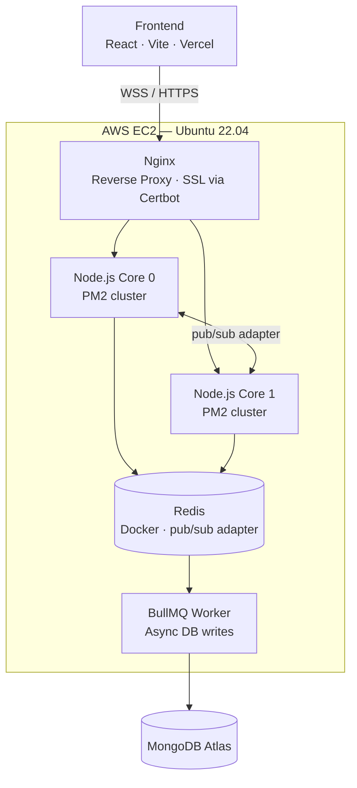

# ♟ Chess Server

A production-grade multiplayer chess server built with Node.js, Socket.IO, and Redis — designed for horizontal scalability and real-time performance.

Inspired by Lichess (LILA), it supports ranked matchmaking, timed arenas, server-side move validation, ELO rating, and PGN/FEN generation.

---

## Tech Stack


---

## Performance

Benchmarked using a custom bot harness (`tests/loadTest.js`) — each pair creates a private arena, plays a full game to completion, and records move RTT (move_attempt → board_sync round trip).

### Live Server — AWS EC2 t3.micro (2 vCPU · 1GB RAM · PM2 cluster · Nginx)

| Concurrent Users    | P50 RTT | P95 RTT | P99 RTT | Throughput    | Success Rate |
| ------------------- | ------- | ------- | ------- | ------------- | ------------ |
| **200** (100 pairs) | 51.2ms  | 143.4ms | 228.0ms | 265 moves/sec | 100/100      |
| **400** (200 pairs) | 157.5ms | 310.4ms | 397.3ms | 357 moves/sec | 182/200      |

**Single-instance ceiling: ~200–300 concurrent users.** At 400, 28 connection errors appear and a 10s max RTT spike indicates resource saturation — the degradation zone, not failure. t3.micro has 2 vCPUs but runs on burstable CPU credits, so sustained load exhausts the credit balance and throttles performance.

### Local — PM2 cluster (all cores · Redis · MongoDB local )

| Concurrent Users    | P50 RTT | P95 RTT | P99 RTT | Throughput    | Success Rate |
| ------------------- | ------- | ------- | ------- | ------------- | ------------ |
| **100** (50 pairs)  | 38.6ms  | 72.2ms  | 150.3ms | 175 moves/sec | 50/50        |
| **500** (250 pairs) | ~140ms  | 292ms   | 405ms   | 120 moves/sec | 250/250      |

### Scaling Extrapolation

The bottleneck on EC2 is CPU — Redis and MongoDB are not the constraint at this scale. The codebase is already built for horizontal scaling: `@socket.io/redis-adapter` handles cross-instance fanout, and a distributed `SET NX` lock prevents duplicate matchmaking across instances.

Adding a second identical EC2 instance behind an ALB would move the clean ceiling from ~300 to ~600 concurrent users. Beyond that, ElastiCache becomes relevant as Redis connection count starts to matter. Current deployment uses single-instance multi-core

---

## Architecture



**Key design decisions:**

- **All game state lives in Redis** any PM2 worker process can handle any request
- **`@socket.io/redis-adapter`** handles cross-instance socket room fanout transparently across all PM2 workers
- **Pure WebSocket transport** (`transports: ["websocket"]`) — bypasses Socket.IO's HTTP polling fallback entirely, which eliminates sticky-session requirements at the load balancer level. All workers share state via Redis so any worker can handle any connection
- **BullMQ worker** handles all MongoDB writes asynchronously after game completion — the game loop never blocks on DB I/O
- **Distributed matchmaking lock** (`redis SET NX`) prevents two PM2 workers from popping the same two players simultaneously
- **`localSockets` Map** in `gameSocket.js` short-circuits `io.to(socketId)` when both players land on the same worker process, avoiding a Redis round-trip

### Why single EC2 + Nginx instead of multi-instance ALB?

The codebase is built for horizontal multi-instance scaling — Redis adapter, distributed locks, and pure WebSocket transport are all in place for it. The current deployment uses a single EC2 instance with PM2 cluster mode across all CPU cores for a practical reason: ALB + ElastiCache adds real cost.

---

## Features

### Game Engine

- Server-side move validation using [chess.js](https://github.com/jhlywa/chess.js)
- Supports all standard end conditions: checkmate, stalemate, threefold repetition, insufficient material, resignation, timeout
- Rich PGN generation with full headers (Event, Site, Date, Players, Result)
- FEN state stored and synced per move

### Matchmaking

- Global matchmaking queue partitioned by time control label (e.g. `"1 min"`, `"5+3"`, `"10"`)
- Distributed lock prevents duplicate matches across PM2 workers
- Player rejoin support — reconnecting players are restored to their active game

### Arena Mode

- Create timed arenas with configurable duration and time control
- Redis-backed queue per arena; automatic expiry cleans up all active games
- After each game, both players are automatically re-queued into the same arena with a 5-second countdown

### Time Controls

- Increment-based clock (Fischer timing)
- Server-enforced timeouts using `setTimeout` with move-count snapshot guards to prevent stale closures from triggering false timeouts
- Clock sync sent to both players on every `board_sync` event

### Ratings

- ELO implementation with dynamic K-factor:
  - K=40 for first 30 games (provisional)
  - K=20 for rating < 2300
  - K=10 for rating ≥ 2300
- Rating deltas computed and returned in `game_over` payload

### Auth

- Firebase Authentication (email/password + Google OAuth)
- JWT issued server-side, stored in `httpOnly` cookie
- Socket.IO middleware validates JWT from cookie on every connection
- Firebase rollback on MongoDB write failure during registration

---

## Project Structure

```
backend/
├── arena/
│   ├── arenaService.js       # Arena lifecycle, queue management, matchmaking
│   └── arenaSocket.js        # join_arena / leave_arena socket handlers
├── config/
│   ├── firebaseAdmin.js      # Firebase Admin SDK init
│   └── redis.js              # ioredis client, pub/sub clients, adapter factory
├── controllers/
│   ├── arenaController.js    # POST /api/arena/create
│   └── authController.js    # Register, login (email + Google), logout
├── middlewares/
│   └── authMiddleware.js     # JWT protect middleware for HTTP routes
├── models/
│   ├── Match.js              # Completed game record (PGN, ratings, end reason)
│   └── User.js               # Player profile (Firebase UID, rating, stats)
├── routes/
│   ├── arenaRoutes.js
│   └── authRoutes.js
├── services/
│   └── gameService.js        # Core game logic: create/get/save/remove game, matchmaking
├── sockets/
│   ├── authSocket.js         # Socket.IO JWT auth middleware
│   ├── gameSocket.js         # move_attempt, resign, rejoin_game handlers
│   ├── matchmakingSocket.js  # enter_arena (global pool) handler
│   └── index.js              # Socket setup, middleware wiring
├── utils/
│   ├── calculateElo.js       # ELO with dynamic K-factor
│   ├── generateTokens.js     # JWT generation
│   ├── regex.js              # Email/password validation
│   └── socketStartMatch.js   # Emits match_started to both players
├── workers/
│   ├── dbQueue.js            # BullMQ queue definition (5 retries, exponential backoff)
│   └── dbWorker.js           # Async MongoDB writes for match results + rating updates
├── tests/
│   └── loadTest.js           # Bot-based load test harness
├── ecosystem.config.cjs      # PM2 cluster config
└── server.js                 # App entry point
```

---

## Socket Events

### Client → Server

| Event          | Payload                           | Description                   |
| -------------- | --------------------------------- | ----------------------------- |
| `enter_arena`  | `{ timeControl }`                 | Join global matchmaking queue |
| `join_arena`   | `{ arenaId }`                     | Join a specific arena queue   |
| `leave_arena`  | `{ arenaId }`                     | Leave arena queue             |
| `move_attempt` | `{ gameId, from, to, promotion }` | Submit a move                 |
| `resign`       | `{ gameId }`                      | Resign the current game       |
| `rejoin_game`  | `{ gameId }`                      | Reconnect to an active game   |

### Server → Client

| Event                | Payload                                                               | Description                   |
| -------------------- | --------------------------------------------------------------------- | ----------------------------- |
| `match_started`      | `{ gameId, color, opponent, fen, timeControl, whiteTime, blackTime }` | Game has begun                |
| `board_sync`         | `{ fen, lastMove, turn, whiteTime, blackTime }`                       | State after every move        |
| `move_rejected`      | `{ reason }`                                                          | Illegal move or not your turn |
| `game_over`          | `{ winner, reason, pgn, ratingChanges }`                              | Game ended                    |
| `rejoin_success`     | Full game state                                                       | Reconnection successful       |
| `rejoin_failed`      | `{ reason }`                                                          | Game no longer exists         |
| `arena_queue_update` | `{ queue, endTime }`                                                  | Live queue state broadcast    |
| `arena_expired`      | `{ arenaId }`                                                         | Arena time ended              |
| `requeue_countdown`  | `{ secondsLeft, arenaId }`                                            | Post-game requeue timer       |

---

## Running Locally

### Prerequisites

- Node.js 18+
- Redis
- MongoDB
- Firebase project (for auth)

### Setup

```bash
git clone https://github.com/Kaustubh-790/Chess-Server
cd chess-server/backend
npm install
```

Create a `.env` file:

```env
PORT=5000
NODE_ENV=development
MONGODB_URI=mongodb://localhost:27017/chess
REDIS_URL=redis://127.0.0.1:6379
JWT_SECRET=your_jwt_secret
CLIENT_URL=http://localhost:5173
FIREBASE_ADMIN_SERVICE_ACCOUNT={"type":"service_account",...}
```

### Start (single instance)

```bash
npm run dev
```

### Start (PM2 cluster)

```bash
npm run start:cluster
```

### Load Test

```bash
# 50 pairs, 100ms move delay
node tests/loadTest.js --pairs=50 --moveDelay=100
```

---

## Deployment

**Backend:** Single AWS EC2 instance(Ubuntu 22.04), PM2 cluster mode across all CPU cores, Nginx as reverse proxy with SSL via Certbot.

**Frontend:** Vercel — static assets, global CDN, instant SSL.

**Database:** MongoDB Atlas.

**Redis:** Docker container on the same EC2 instance.

---

## Roadmap

- [ ] Per-move engine analysis (Stockfish integration)
- [ ] Cheat detection
- [ ] Spectator mode
- [ ] Tournament bracket support
- [ ] Multi-instance horizontal scaling (ALB + ElastiCache) — architecture is there, infrastructure is a cost decision
