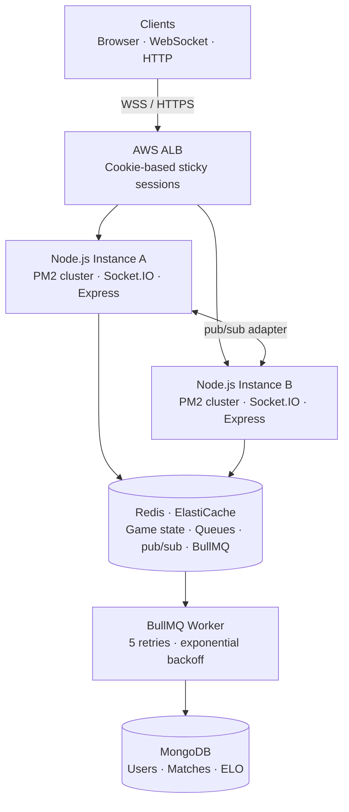

# ♟ Chess Server

A production-grade multiplayer chess server built with Node.js, Socket.IO, and Redis — designed for horizontal scalability and real-time performance.

Inspired by Lichess (LILA), it supports ranked matchmaking, timed arenas, server-side move validation, ELO rating, and rich PGN/FEN metadata generation.

---

## Tech Stack


---

## Performance

> **Tested locally** — load test run on a single machine using PM2 cluster mode. Numbers reflect real WebSocket RTT under concurrent load, not a cloud deployment.

Load tested at **500 concurrent users** using a custom bot harness (`tests/loadTest.js`):

| Metric                          | Result         |
| ------------------------------- | -------------- |
| **P50 RTT** (move → board_sync) | ~140ms         |
| **P95 RTT**                     | **292ms**      |
| **P99 RTT**                     | **405ms**      |
| Concurrent users                | 500            |
| Move throughput                 | ~120 moves/sec |

Tested with PM2 cluster mode (all CPU cores) + Redis pub/sub adapter for cross-instance socket fanout.

---

## Architecture



**Key design decisions:**

- **All game state lives in Redis**, so any instance can handle any request
- **`@socket.io/redis-adapter`** handles cross-instance socket room fanout transparently
- **Sticky sessions at the ALB** keep a player's WebSocket on the same instance — explained in detail below
- **BullMQ worker** handles all MongoDB writes asynchronously after game completion — the game loop never blocks on DB I/O
- **Distributed matchmaking lock** (`redis SET NX`) prevents two instances from popping the same two players simultaneously
- **`localSockets` Map** in `gameSocket.js` short-circuits `io.to(socketId)` when both players are on the same instance, avoiding a Redis round-trip

---

## Features

### Game Engine

- Server-side move validation using [chess.js](https://github.com/jhlywa/chess.js)
- Supports all standard end conditions: checkmate, stalemate, threefold repetition, insufficient material, resignation, timeout
- Rich PGN generation with full headers (Event, Site, Date, Players, Result)
- FEN state stored and synced per move

### Matchmaking

- Global matchmaking queue partitioned by time control label (e.g. `"1 min"`, `"5+3"`, `"unlimited"`)
- Distributed lock prevents duplicate matches across PM2 instances
- Player rejoin support — reconnecting players are restored to their active game

### Arena Mode

- Admin-created timed arenas with configurable duration and time control
- Redis-backed queue per arena; automatic expiry cleans up all active games
- After each game, both players are automatically re-queued into the same arena with a 5-second countdown

### Time Controls

- Increment-based clock (Fischer timing)
- Server-enforced timeouts using `setTimeout` with move-count snapshot guards to prevent stale closures from triggering false timeouts
- Clock sync sent to both players on every `board_sync` event

### Ratings

- ELO implementation with dynamic K-factor:
  - K=40 for first 30 games (provisional)
  - K=20 for rating < 2300
  - K=10 for rating ≥ 2300
- Rating deltas computed and returned in `game_over` payload

### Auth

- Firebase Authentication (email/password + Google OAuth)
- JWT issued server-side, stored in `httpOnly` cookie
- Socket.IO middleware validates JWT from cookie on every connection
- Firebase rollback on MongoDB write failure during registration

---

## Project Structure

```
backend/
├── arena/
│   ├── arenaService.js       # Arena lifecycle, queue management, matchmaking
│   └── arenaSocket.js        # join_arena / leave_arena socket handlers
├── config/
│   ├── firebaseAdmin.js      # Firebase Admin SDK init
│   └── redis.js              # ioredis client, pub/sub clients, adapter factory
├── controllers/
│   ├── arenaController.js    # POST /api/arena/create
│   └── authController.js    # Register, login (email + Google), logout
├── middlewares/
│   └── authMiddleware.js     # JWT protect middleware for HTTP routes
├── models/
│   ├── Match.js              # Completed game record (PGN, ratings, end reason)
│   └── User.js               # Player profile (Firebase UID, rating, stats)
├── routes/
│   ├── arenaRoutes.js
│   └── authRoutes.js
├── services/
│   └── gameService.js        # Core game logic: create/get/save/remove game, matchmaking
├── sockets/
│   ├── authSocket.js         # Socket.IO JWT auth middleware
│   ├── gameSocket.js         # move_attempt, resign, rejoin_game handlers
│   ├── matchmakingSocket.js  # enter_arena (global pool) handler
│   └── index.js              # Socket setup, middleware wiring
├── utils/
│   ├── calculateElo.js       # ELO with dynamic K-factor
│   ├── generateTokens.js     # JWT generation
│   ├── regex.js              # Email/password validation
│   └── socketStartMatch.js   # Emits match_started to both players
├── workers/
│   ├── dbQueue.js            # BullMQ queue definition (5 retries, exponential backoff)
│   └── dbWorker.js           # Async MongoDB writes for match results + rating updates
├── tests/
│   └── loadTest.js           # Bot-based load test harness
├── ecosystem.config.cjs      # PM2 cluster config
└── server.js                 # App entry point
```

---

## Socket Events

### Client → Server

| Event          | Payload                           | Description                   |
| -------------- | --------------------------------- | ----------------------------- |
| `enter_arena`  | `{ timeControl }`                 | Join global matchmaking queue |
| `join_arena`   | `{ arenaId }`                     | Join a specific arena queue   |
| `leave_arena`  | `{ arenaId }`                     | Leave arena queue             |
| `move_attempt` | `{ gameId, from, to, promotion }` | Submit a move                 |
| `resign`       | `{ gameId }`                      | Resign the current game       |
| `rejoin_game`  | `{ gameId }`                      | Reconnect to an active game   |

### Server → Client

| Event                | Payload                                                               | Description                   |
| -------------------- | --------------------------------------------------------------------- | ----------------------------- |
| `match_started`      | `{ gameId, color, opponent, fen, timeControl, whiteTime, blackTime }` | Game has begun                |
| `board_sync`         | `{ fen, lastMove, turn, whiteTime, blackTime }`                       | State after every move        |
| `move_rejected`      | `{ reason }`                                                          | Illegal move or not your turn |
| `game_over`          | `{ winner, reason, pgn, ratingChanges }`                              | Game ended                    |
| `rejoin_success`     | Full game state                                                       | Reconnection successful       |
| `rejoin_failed`      | `{ reason }`                                                          | Game no longer exists         |
| `arena_queue_update` | `{ queue, endTime }`                                                  | Live queue state broadcast    |
| `arena_expired`      | `{ arenaId }`                                                         | Arena time ended              |
| `requeue_countdown`  | `{ secondsLeft, arenaId }`                                            | Post-game requeue timer       |

---

## Running Locally

### Prerequisites

- Node.js 18+
- Redis
- MongoDB
- Firebase project (for auth)

### Setup

```bash
git clone https://github.com/Kaustubh-790/Chess-Server
cd chess-server/backend
npm install
```

Create a `.env` file:

```env
PORT=5000
NODE_ENV=development
MONGODB_URI=mongodb://localhost:27017/chess
REDIS_URL=redis://127.0.0.1:6379
JWT_SECRET=your_jwt_secret
CLIENT_URL=http://localhost:5173
FIREBASE_ADMIN_SERVICE_ACCOUNT={"type":"service_account",...}
```

### Start (single instance)

```bash
npm run dev
```

### Start (PM2 cluster)

```bash
npm run start:cluster
```

### Load Test

```bash
# 50 pairs, 100ms move delay
node tests/loadTest.js --pairs=50 --moveDelay=100
```

---

## Deployment

**Current status:** Runs locally via PM2 cluster mode. Redis and MongoDB run via Docker.

**Planned deployment (in progress):** AWS EC2 instances behind an ALB with cookie-based sticky sessions + ElastiCache Redis. The codebase is already built for this — `@socket.io/redis-adapter` handles cross-instance fanout, PM2 cluster config is committed, sticky session handling is documented above.

> Render deployment was attempted but breaks in multi-instance mode due to lack of sticky session control on their free tier. A single-instance Render deploy works fine.

### Recommended AWS setup

```
ALB (cookie-based sticky sessions enabled)
  ├── EC2 t2.micro (Node.js instance A)
  └── EC2 t2.micro (Node.js instance B)
            ↕
    ElastiCache Redis (or self-hosted on a third t2.micro)
```

1. Launch 2+ EC2 instances, clone and run the server on each
2. Create an ALB target group pointing to both instances
3. Enable **duration-based stickiness** (AWS console → Target Group → Attributes)
4. Point `REDIS_URL` on all instances to shared Redis
5. Done — instances share all game state through Redis; the adapter handles socket room fanout automatically

---

## Known Limitations / Roadmap

- [ ] **AWS deployment in progress** — single-instance local works; multi-instance ALB setup planned for next sprint
- [ ] **Minimal test frontend included** — a barebones client exists in `/frontend` to validate gameplay locally. It is not production UI and not the focus of this project
- [ ] Per-move engine analysis (Stockfish integration)
- [ ] Cheat detection
- [ ] Spectator mode
- [ ] Tournament bracket support
- [ ] Production frontend
